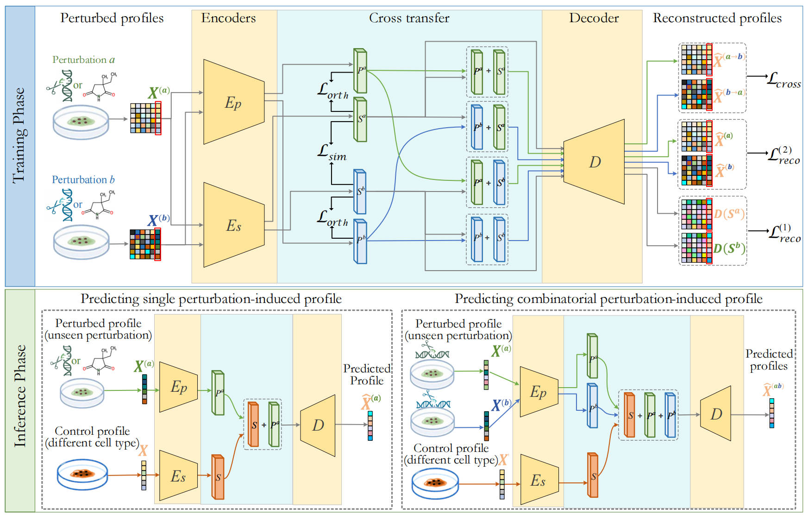

# Learning Cross-Domain Representations for Transferable Drug Perturbations on Single-Cell Transcriptional Responses

## Model architecture



The gene expression profiles $X^{(a)}$ and $X^{(b)}$ of a sample cell $X$ under perturbations $a$ and $b$, represented as vector-type data, serve as inputs. These inputs are decoupled by the cell state feature extractor $E_S$ and the perturbation feature extractor $E_P$, resulting in cell state feature embedding vectors $S^a$ and $S^b$ for cell $X$, as well as perturbation feature embedding vectors $P^a$ and $P^b$ for perturbations $a$ and $b$. These embedding vectors undergo cross-transfer and combination, yielding $P^a + S^a$, $P^b + S^a$, $P^a + S^b$, and $P^b + S^b$, which are subsequently fed into the decoder $D$ to produce the corresponding reconstructed gene expression profiles.

## Requirements

The deep learning models were trained on 2*NVIDIA GeForce RTX 4090 on linux.

+ Python 3.11
+ CUDA 12.2
+ PyTorch 2.0
+ Pandas 2.1.4
+ Numpy 1.26.3
+ Scikit-learn 1.3.0

## Usage

To setup the environment, install conda and run (Must run on servers with multiple GPUs):

```bash
conda create --name <your_env_name> --file requirements.txt
```

To train this model and obtain results, you need to download the dataset (Example: Sci-plex3), place it in the datasets folder, and then run:


```bash
torchrun --nproc_per_node=2 --master-port=29501  XTransferCDR/train.py
```

If you want to train other datasets, you need to modify the `XTransferCDR/train.py` section

## Directory structure

+ `XTransferCDR`: contains the code for the model, the evaluation, and the training loop.

+ `configs`: Configuration file for hyperparameters.

+ `datasets`: This directory needs to be created by yourself to store experimental data.

+ `results`: This directory needs to be created by oneself. It is used to store the results of the experiment.

    + `modules`: Model storage directory.

    + `plot`: Training loss curve.

    + `plot_data`: Data of the training process.
